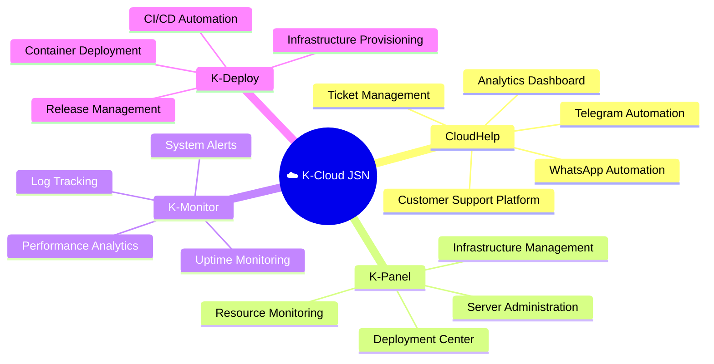

<div align="center">


<p>


</p>

</div>

---

# ☁️ About K-Cloud JSN

K-Cloud JSN is a technology ecosystem focused on building cloud infrastructure, automation platforms, AI-powered solutions, and modern digital products.

Our mission is to create scalable, reliable, and innovative systems that help businesses and communities accelerate their digital transformation.

---

# 🌐 Ecosystem



---

## 🛠 Technology Stack

<div align="center">


</div>

---

## 📊 GitHub Statistics

<div align="center">


</div>

---

## 📈 Contribution Graph

<div align="center">


</div>

---

## 🏗️ Architecture

```text
Internet
    │
    ▼
K-Cloud JSN
    │
    ├── Cloud Services
    ├── Automation Services
    ├── AI Services
    ├── Monitoring Services
    └── Business Solutions
            │
            ▼
      Database Cluster
```

## 📂 Structure

```text
K-Cloud-JSN
│
├── CloudHelp
│   ├── Dashboard
│   ├── Admin Panel
│   ├── Telegram Bot
│   ├── WhatsApp Bot
│   └── Analytics
│
├── K-Panel
├── K-Monitor
├── K-Deploy
│
├── Infrastructure
├── APIs
├── Documentation
└── Services
```

---

## 🌟 Products

| Product | Description |
|----------|------------|
| CloudHelp | Customer Support & Automation Platform |
| K-Panel | Cloud Infrastructure Dashboard |
| K-Monitor | Monitoring & Alerting System |
| K-Bot | Automation & Messaging Platform |
| K-Deploy | Deployment Management System |

---

## 🎯 Roadmap

- [x] Cloud Infrastructure
- [x] Monitoring Platform
- [x] Automation Services
- [x] API Ecosystem
- [ ] AI Workspace
- [ ] Mobile Application
- [ ] SaaS Marketplace
- [ ] Kubernetes Integration
- [ ] Enterprise Solutions

---

## 🤝 Contributing

```bash
git clone https://github.com/YOUR_USERNAME/k-cloud-jsn.git

cd k-cloud-jsn

npm install

npm run dev
```

---

## 📬 Connect

<div align="center">

<a href="https://github.com/YOUR_USERNAME">

</a>

</div>

---

<div align="center">

# K-Cloud JSN

### Cloud • Automation • Innovation

**Building Digital Solutions for Tomorrow 🚀**


</div>
