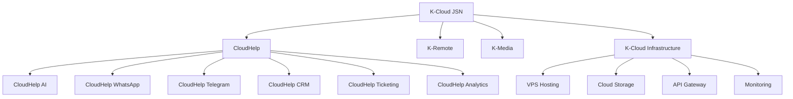
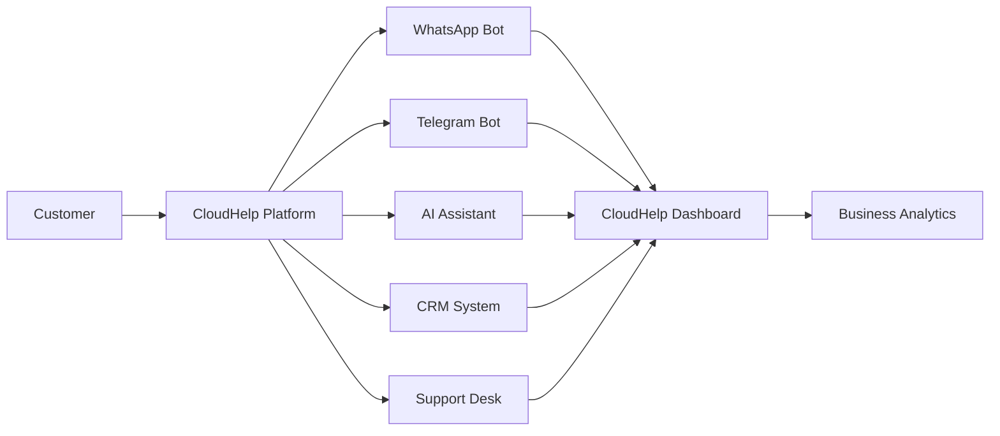

<div align="center">


[](https://git.io/typing-svg)

<br>


</div>

---

# 🌍 About K-Cloud JSN

K-Cloud JSN is a technology ecosystem focused on building digital solutions, cloud platforms, AI automation, business tools, and innovative technologies that empower individuals, startups, and businesses to thrive in the digital era.

### 🎯 Vision

To become a technology ecosystem that connects people, businesses, and innovation without limits.

### 🚀 Mission

- Develop modern digital platforms.
- Accelerate business growth through automation.
- Build accessible and practical AI solutions.
- Create an integrated technology ecosystem.

---

# 👩 Founder

<div align="center">

## Kaira Adira Rahayu

### Founder • Builder • Digital Innovator

Building technology, communities, and opportunities for the future.

</div>

---

# 🎯 Core Focus

<div align="center">

| ☁️ Cloud Technology | 🤖 AI Automation | 💬 Bot Development |
|:---:|:---:|:---:|
| Cloud Infrastructure | Intelligent Solutions | WhatsApp & Telegram Platforms |

| 📈 Business Solutions | 🌐 Digital Communities | 🚀 Startup Innovation |
|:---:|:---:|:---:|
| CRM & Automation | Community Ecosystems | Future Digital Products |

</div>

---

# ☁️ K-Cloud JSN Ecosystem

<div align="center">

```text
                            ☁️ K-CLOUD JSN
                   Technology • Innovation • Growth

        ┌───────────────────┬───────────────────┬───────────────────┐
        │                   │                   │                   │
        ▼                   ▼                   ▼                   ▼

    🤖 CloudHelp       🌐 K-Remote         🎨 K-Media      ☁️ Infrastructure

    AI Assistant       Job Board          Content Studio      VPS Hosting
    WhatsApp Bot       Freelancer Hub     Social Media        Cloud Storage
    Telegram Bot       Team Workspace     Marketing           API Gateway
    CRM System         Collaboration      Branding            Monitoring
    Analytics
```

</div>

---

# 📊 Product Architecture



---

# 🌐 CloudHelp Platform Flow



---

# 🛠 Technology Stack

<div align="center">


</div>

<br>

| Category | Technologies |
|----------|-------------|
| ⚙️ Backend | Python • Node.js • FastAPI |
| 🎨 Frontend | React • Next.js • Tailwind CSS |
| 🗄 Database | PostgreSQL • MongoDB • Redis |
| ☁️ Infrastructure | Docker • Linux • Cloud Services |
| 🤖 Automation | WhatsApp API • Telegram API • AI Integration |

---

# 🚀 Product Roadmap

```text
2026
│
├── 🟢 Foundation
│   ├── K-Cloud JSN Branding
│   ├── GitHub Organization
│   └── CloudHelp Architecture
│
├── 🟡 Platform Development
│   ├── Customer Dashboard
│   ├── WhatsApp Integration
│   └── Telegram Integration
│
├── 🔵 Smart Automation
│   ├── AI Assistant
│   ├── CRM Platform
│   └── Ticketing System
│
└── 🟣 Enterprise Expansion
    ├── Analytics Platform
    ├── Team Workspace
    ├── Multi-Channel Automation
    └── Enterprise Suite
```

<div align="center">

🟢 Completed • 🟡 In Progress • 🔵 Planned • 🟣 Future

</div>

---

# 📦 Active Projects

<div align="center">

| Project | Category | Progress |
|----------|----------|----------|
| 🤖 CloudHelp Core | SaaS Platform | ████████░░ 80% |
| 💬 CloudHelp WhatsApp | Automation | ██████░░░░ 60% |
| ✈️ CloudHelp Telegram | Automation | ██████░░░░ 60% |
| 🧠 CloudHelp AI | Artificial Intelligence | ███░░░░░░░ 30% |
| 👥 CloudHelp CRM | Business Solution | ████░░░░░░ 40% |
| ☁️ K-Cloud Infrastructure | Cloud Services | █████░░░░░ 50% |

</div>

---

# 🌐 Domain Structure

```text
🏢 kcloudjsn.com

🤖 cloudhelp.kcloudjsn.com

👤 app.cloudhelp.kcloudjsn.com

⚙️ admin.cloudhelp.kcloudjsn.com

🔌 api.cloudhelp.kcloudjsn.com

📚 docs.cloudhelp.kcloudjsn.com
```

---

# 🤝 Open Collaboration

We welcome collaboration with:

- 💻 Software Developers
- 🎨 UI/UX Designers
- 📱 Digital Marketers
- 🤖 AI Engineers
- 🚀 Startup Builders
- 🌍 Community Leaders

---

# 💡 Our Values

✨ Innovation

🤝 Collaboration

🚀 Growth

🌍 Impact

🔒 Reliability

---

<div align="center">


# ☁️ K-Cloud JSN

### Innovate • Connect • Grow

### Building Technology That Creates Opportunities

🚀 Powered by Kaira Studio

</div>
